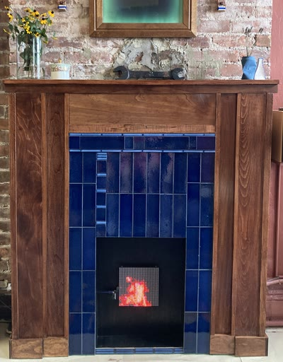
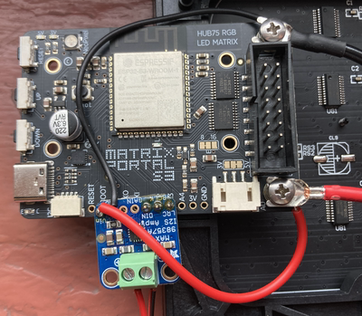

# LED Matrix Animation - Faux Fireplace



I built an LED animation of fire with accompanying sound to enhance the faux fireplace I built in my living room. This repo contains code and instructions on how to build your own animation gif and audio .wav, running on an: 
- [Adafruit MatrixPortal S3](https://www.adafruit.com/product/5778)
- driving a [32x32 RGB LED Matrix Panel - 6mm pitch](https://www.adafruit.com/product/1484),
- Sound provided by a [Mono Enclosed Speaker - 3W 4 Ohm](https://www.adafruit.com/product/3351), 
- amplified by an [Adafruit I2S 3W Class D Amplifier Breakout - MAX98357A](https://www.adafruit.com/product/3006).
- I power my unit with a usb-c charging cable that I spliced an on/off rocker into.

<br clear="left"/>
<br/>

The project has the following parts:
- **Hardware:** Connecting and in some cases soldering all the parts together.
- **Power:** How to power the unit.
- **Video → GIF** processing scripts (animation)
- **Audio processing** scripts (looping sound)
- **`code.py`:** the CircuitPython script that runs on the board, playing the GIF and audio together.

---

## Assembling the hardware


### Plug-and-play (no soldering)

- **LED matrix panel → MatrixPortal S3**: connects via the included HUB75
  ribbon cable, straight into the matrix connector on the MatrixPortal S3.
  No soldering — just seat the connector firmly, keyed so it only goes in
  one way.
- **Speaker → MAX98357A amp**: the speaker's two wires connect to the amp's
  speaker output screw terminals (labeled `+` and `-`). Loosen the
  terminal screws, insert the wires, and tighten — no solder required.
  Polarity isn't critical for a single small speaker like this, but keep it
  consistent if you ever add a second speaker.

### Requires soldering


**MAX98357A amp → MatrixPortal S3 (digital audio signal)**

The amp needs three signal wires soldered from its input pins to three pins
on the MatrixPortal S3, matching the I2S pins configured in `code.py`
(`board.A1`, `board.A2`, `board.A3`):

| MAX98357A pin | Solder to MatrixPortal S3 pin | Purpose |
|---|---|---|
| `DIN`  | `A1` | Audio data |
| `BCLK` | `A2` | Bit clock |
| `LRC`  | `A3` | Word select (L/R clock) |

Leave the amp's `SD` (shutdown) and `GAIN` pins unconnected. Both are fine
floating for standard mono, default-gain playback.

**Power distribution (amp + matrix, both from the MatrixPortal's screw terminals)**

Both the LED matrix and the MAX98357A draw power from the MatrixPortal
S3's two screw terminals (`+5V` and `GND`), which in turn get their power
from the single USB-C input. Since it's a screw terminal block, you can
land two wires under the same screw.

| MatrixPortal S3 terminal | Feeds |
|---|---|
| `+5V` | LED matrix `+5V` lead **and** MAX98357A `VIN` |
| `GND` | LED matrix `GND` lead **and** MAX98357A `GND` |

**USB-C power cable with inline rocker switch**

```
USB-C power supply (max 60W)
        │
        ▼
  MatrixPortal S3 (USB-C port)
        │
        ▼
  Screw terminals (+5V / GND)
    │                        │
    ▼                        ▼
LED matrix panel        MAX98357A audio amp
power input              (I2S audio out)
```

- The matrix panel and the MAX98357A amp both draw their power from the
  MatrixPortal's screw terminals, in parallel.
- There is no separate wall supply and no DC splitter — one USB-C cable
  powers the whole build.
- Since the panel's power now comes through the board rather than a
  dedicated line, keep an eye on brightness/current draw: if you ever see
  flickering, dimming, or resets under bright frames, it's a sign the
  combined draw is approaching the supply's limit, and lowering
  `BRIGHTNESS` in `code.py` is the easiest fix.
- Because power comes in only through USB-C now, reprogramming the board is simple, just plug in the same (or another) USB-C cable from your computer; there's no second power path to disconnect first.

To add an on/off switch to the USB-C power cable itself:

1. Cut the cable and strip back the outer jacket to expose the internal
   wires. You only need to work with the **red (VBUS/+5V) wire** — leave
   the black (GND), green/white (D+/D-), and any CC-line wires fully
   intact and untouched.
2. Cut the red wire only, and solder each end to one terminal of the
   rocker switch, so the switch sits inline on the +5V line.
3. Insulate both solder joints with heat-shrink tubing, and use a larger
   piece of heat-shrink (or a project box cutout for the switch) to keep
   the whole splice mechanically protected once it's mounted in the
   fireplace.

With this wired, flipping the rocker switch cuts +5V power to the
MatrixPortal S3, which shuts down everything downstream (matrix and amp)
along with it — one switch controls the whole build.

## Create the GIF


You must have the library ffmpeg installed
1. Place your source video at `source-video/input.mp4`
2. If you're running the scripts for the first time, make the scripts executable:

```bash
chmod +x scripts/*.sh
```
3. From the `led_project/` root folder, run each script in order, one at a time. Temporary videos will be created after each step and kept in `working-video`.
```
./scripts/01_crop_to_square.sh
```
```
./scripts/02_resize_32x32.sh
```
```
./scripts/03_color_grade.sh
```
```
./scripts/04_make_gif.sh
```
The `turn_gif_upsidedown` script is optional. Run it if you need your gif to be upside down like I did:
```
./scripts/05_turn_gif_upsidedown.sh
```

4. Your final GIF will be at `output-gif/animation.gif`. It's ready to copy onto
   the MatrixPortal S3 (see below).

### Notes
- Step 3 defaults to 12 fps. At 15 seconds long, that's 180 frames total — a good
  balance of smoothness vs. file size for a 32x32 panel. If you want slightly
  smoother motion, open `scripts/03_convert_to_gif.sh` and change `FPS=12` to
  `FPS=15`, but check the resulting file size isn't ballooning too much.
- The GIF is set to loop infinitely (`-loop 0`).
- `working-video/` files are intermediate and safe to delete once you're happy
  with the final GIF in `output-gif/`.
---

## Create the ambient audio

The sound loops continuously in the background alongside the
animation, over I2S audio out from the MatrixPortal S3.

### What the script does
- Trims the first 2 seconds off the source (avoids clicks/pops or fade-ins
  common at the start of a recording).
- Keeps the next 20 seconds after that as the loop segment.
- Converts to **16-bit mono PCM @ 22050 Hz** — the exact format
  `audiocore.WaveFile` expects on the MatrixPortal S3. If you use a different
  sample rate or channel count, you must also update `SAMPLE_RATE` and
  `channel_count` in `code.py` to match, or playback will be pitched/sped up
  incorrectly.
- Trims a few trailing samples so the total sample count divides evenly into
  the audio buffer size (2048), which prevents an audible click/gap at the
  loop point.

### Notes
- Only the **first** `.wav`/`.mp3` source file found in `sound/` gets
  processed per run if you have multiple — check the script output to
  confirm which file was picked up.
- `code.py` automatically finds and plays whatever single `_processed.wav`
  (or any `.wav`) file exists in the board's `/sound/` folder — the filename
  itself doesn't need to be hardcoded anywhere.

1. Place your source `.wav` or `.mp3` file in the `sound/` folder, alongside
   `process_wav.sh`.
2. If you're running the script for the first time, make the script executable:

```
cd sound
chmod +x process_wav.sh
```
2. Run the script from inside `sound/`:
```
./process_wav.sh
```

3. This produces `<original_name>_processed.wav` in the same folder — leave
   your original source file untouched, and copy the `_processed.wav` file
   onto the board (see below).

---


## Preparing the MatrixPortal S3 and loading everything

This project runs on **CircuitPython**.  `code.py` handles both the GIF animation and looping audio.

Official references:
- MatrixPortal S3 overview & CircuitPython install: https://learn.adafruit.com/adafruit-matrixportal-s3
- CircuitPython download page for this board: https://circuitpython.org/board/adafruit_matrixportal_s3/

### Step 1 — Install/confirm CircuitPython is on the board

1. Plug the board into your computer with a known-good data/sync USB-C cable
   (charge-only cables won't work).
2. It should mount as a drive called `CIRCUITPY`. If not, follow the
   CircuitPython install guide linked above to flash it.

### Step 2 — Copy files onto the board

Copy the following onto the `CIRCUITPY` drive, preserving this structure:

```
CIRCUITPY/
├── code.py
├── gifs/
│   └── animation.gif          ← from output-gif/
└── sound/
    └── <name>_processed.wav   ← from sound/
```

- `code.py` **must** be at the root of the drive, spelled exactly `code.py`.
- The `gifs` and `sound` folder names must match exactly (lowercase) since
  `code.py` looks for them by these names.

### Step 3 — Watch it run

As soon as the file copy finishes, CircuitPython auto-reloads and runs
`code.py`. To confirm it's working correctly or debug problems, connect via
serial (e.g. the [Mu editor](https://codewith.mu/)) and watch for a
traceback — a clean run shows no output and the panel lights up with the
animation and audio.

---


## `code.py` overview

At a high level, `code.py`:
- Initializes the 32x32 RGB matrix via `rgbmatrix`/`framebufferio`.
- Opens `/gifs/animation.gif` and loops it frame-by-frame using `gifio`.
- Dims each frame in software via `bitmaptools.alphablend()` against a
   black bitmap, controlled by the `BRIGHTNESS` constant (0.0–1.0), since
   the matrix hardware itself has no brightness control.
- Sets up I2S audio output and loops whatever `.wav` file it finds in
   `/sound/` continuously in the background via `audiomixer`, at a volume
   set by the `FIRE_VOLUME` constant (0.0–1.0).

### Tuning to taste
- **`BRIGHTNESS`** (near the top of the animation setup) — lower for a
  darker, more ember-like glow; raise for a brighter flame. 0.4–0.6 gives a
  noticeably dimmer, warmer look than full brightness.
- **`FIRE_VOLUME`** (near the audio setup) — adjust ambient crackle loudness
  independent of brightness.
---


## Troubleshooting notes

- **`AttributeError: 'OnDiskGif' object has no attribute 'pixel_shader'`** —
  newer CircuitPython versions require manually building a
  `displayio.ColorConverter` rather than using a `.pixel_shader` property
  directly off the gif object. Already handled in `code.py`.
- **Hard fault / safe mode on boot** — usually means `display.refresh()` was
  called with an invalid argument (e.g. `target_frames_per_second=0`), or a
  `TileGrid` was built before the first gif frame was loaded via
  `next_frame()`. Both are already handled correctly in `code.py`; if you
  modify the script, keep the frame-load-before-TileGrid ordering intact.
- **`TypeError: unexpected keyword argument 'factor1'`** or
  **`ValueError: Bitmap size and bits per value must match`** — depending on
  CircuitPython version, `bitmaptools.alphablend()` may need the brightness
  factor passed positionally rather than as `factor1=`, and both bitmaps
  passed in must share the same bits-per-pixel format. Already handled in
  `code.py`.
- **Only reds/oranges show, no white/blue** — check that the matrix panel's
  power leads are actually connected to the screw terminals and not left
  disconnected — red LEDs have a lower forward voltage than blue/green, so
  a panel receiving only parasitic power through its data lines (with no
  real connection to the +5V/GND terminals) will often show dim reds only.
